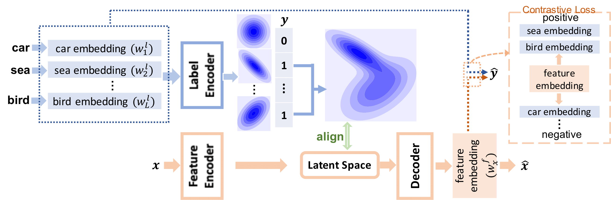

# Gaussian Mixture VAE with Contrastive Learning for Multi-Label Classification (C-GMVAE)

<div align=center></div>

The implementation of [C-GMVAE](https://arxiv.org/abs/2112.00976) using PyTorch.

# Sample Dataset
We use mirflickr as our running example since it is commonly used and has a moderate size. Dataset location: data/mirflickr

# Dependencies
- Python 3.7+
- PyTorch 1.7.0
- numpy 1.17.3
- sklearn 0.22.1

Older versions might work as well.

# Run
To train the model:
``bash script/run_train_mirflickr.sh``

To test the model (this .sh will be produced automatically):
``bash script/run_test_mirflickr.sh``

The seed is 1 by default, but can be changed in the bash file.

## Paper

If you find our work interesting, please consider citing the following paper:

```bibtex
@inproceedings{bai2022gaussian,
  title={Gaussian Mixture Variational Autoencoder with Contrastive Learning for Multi-Label Classification},
  author={Bai, Junwen and Kong, Shufeng and Gomes, Carla P},
  booktitle={International Conference on Machine Learning},
  pages={1383--1398},
  year={2022},
  organization={PMLR}
}
```

## Related Repo

[MPVAE](https://github.com/JunwenBai/MPVAE)
